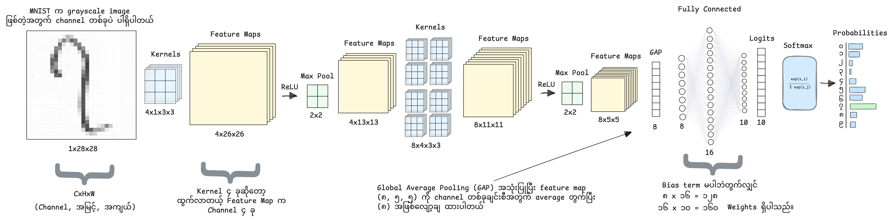

# Understanding CNN from Scratch

### [ကွန်ပျူတာကို မြန်မာဂဏန်းတွေ ဖတ်တတ်အောင်ဘယ်လိုသင်ပေးမလဲ?<br>(Understanding CNN from Scratch)](https://medium.com/@nye1nchansoe/ကွန်ပျူတာကို-မြန်မာဂဏန်းတွေ-ဖတ်တတ်အောင်ဘယ်လိုသင်ပေးမလဲ-understanding-cnn-from-scratch-8e6f64e39c91)

The core implementation used for the article is inside:

```text
.
└── notebooks/
    └── burmese_digits_cnn_pytorch.ipynb
```

It is a learning project that shows how a Convolutional Neural Network can classify Burmese handwritten digits from `၀` to `၉`.

---

## Model Architecture



The CNN used in the notebook is intentionally simple:

```text
Input: 1 × 28 × 28 grayscale image

Conv2D: 1 → 32 channels
ReLU
MaxPool

Conv2D: 32 → 64 channels
ReLU
MaxPool

Flatten
Linear: 64 × 7 × 7 → 128
ReLU
Linear: 128 → 10 classes
```

---

## Dataset

This project uses the **[BHDD (Burmese Handwritten Digit Dataset)](https://github.com/baseresearch/BHDD)**.

You need to place the dataset file manually before running the notebook.

Expected location:

```text
BHDD/data.pkl
```

*Credit to the original authors and research team. Please follow the dataset’s license and terms of use.*

<details>
<summary>Dataset citation</summary>

```bibtex
@article{bhdd2026,
  author    = {Swan Htet Aung and Hein Htet and Htoo Say Wah Khaing and Thuya Myo Nyunt},
  title     = {{BHDD}: A Burmese Handwritten Digit Dataset},
  journal   = {arXiv preprint arXiv:2603.21966},
  year      = {2026},
  url       = {https://arxiv.org/abs/2603.21966}
}
```

</details>

---

## Setup

This project uses **uv** for dependency management.

Install dependencies:

```bash
uv sync
```

---

## Article

https://medium.com/@nye1nchansoe/ကွန်ပျူတာကို-မြန်မာဂဏန်းတွေ-ဖတ်တတ်အောင်ဘယ်လိုသင်ပေးမလဲ-understanding-cnn-from-scratch-8e6f64e39c91